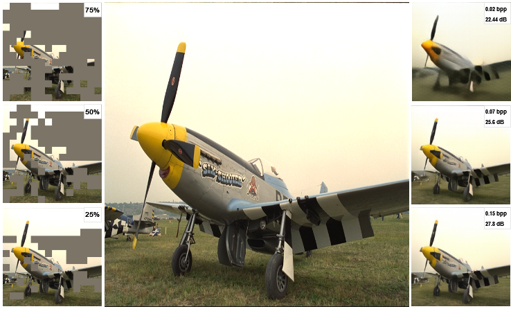

# TextMAE-Image-Compression


## Results



## Datasets
| Phase       | Dataset        | Link                                                     |
|-------------|----------------|----------------------------------------------------------|
| Training    | DIV2K          | [Link](https://data.vision.ee.ethz.ch/cvl/DIV2K/)        |
| Training    | Vimeo90K       | [Link](http://toflow.csail.mit.edu/)                     |
| Training    | ImageNet       | [Link](https://image-net.org/download.php)               |
| ----------- | -------------- | ------                                                   |
| Testing     | REDS           | [Link](https://seungjunnah.github.io/Datasets/reds.html) |
| Testing     | CLIC           | [Link](https://compression.cc/tasks/#image)              |
| Testing     | Kodak          | [Link](https://r0k.us/graphics/kodak/)                   |

```angular2html
datasets
├─📁 train_dataset
│  ├─📁 train
│  │  ├─🖼️ train01.png
│  │  ├─🖼️ train02.png
│  │  ├─...
│  ├─📁 val
│  │  ├─🖼️ val01.png
│  │  ├─🖼️ val02.png
│  │  ├─...
├─📁 test_dataset
│  ├─🖼️ test01.png
│  ├─🖼️ test02.png
│  ├─...
├─📁 train_scores
│  ├─📄 train.pt
│  ├─📄 val.pt
└─📁 test_scores
   └─📄 test.pt
```

## Acknowledgements
We appreciate the following repositories for their valuable contributions to our project:
- [MAE](https://github.com/facebookresearch/mae)
- [BLIP](https://github.com/salesforce/BLIP)
- [Stable Diffusion Refiner](https://github.com/Stability-AI/generative-models)