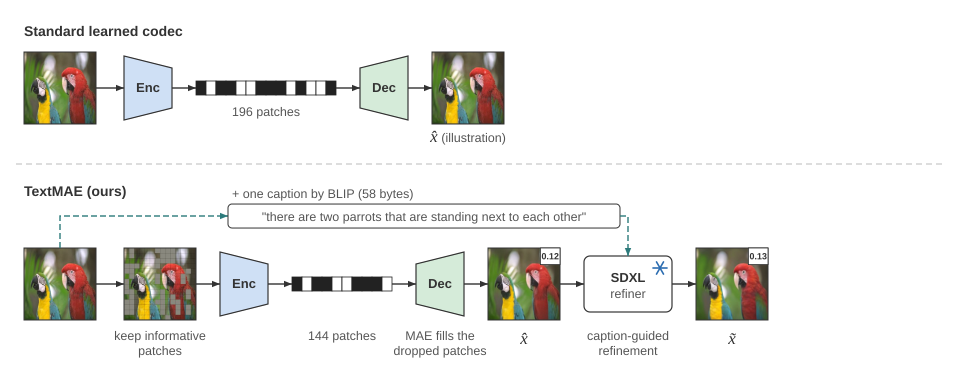
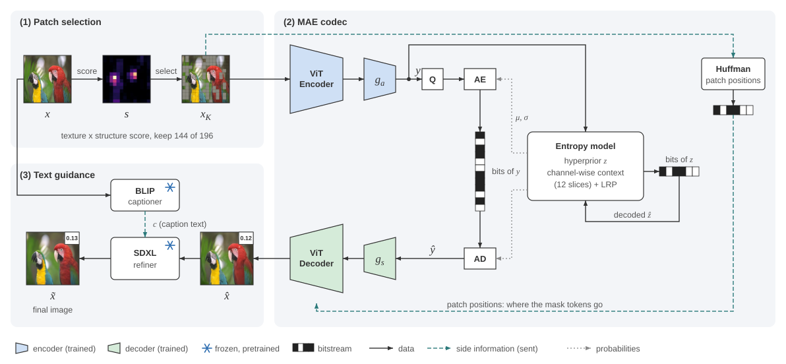

<div align="center">

# TextMAE: Text-Guided Masked Autoencoders for Low-Bitrate Image Compression

**Send only the patches that matter and one sentence of text. A Masked Autoencoder and a diffusion model rebuild the rest.**

[Khang Tran](https://github.com/tmkhang1999) &nbsp;|&nbsp; personal research project, 2023


<sub>Left: what the encoder sees when 75, 50 or 25 % of the patches are dropped (gray). Middle: original. Right: decoded images at three bit rates, labeled with bits per pixel (bpp) and PSNR.</sub>

</div>

## TL;DR

Image codecs spend bits on every region of an image, including smooth sky and blurred background that a neural network could easily fill in. TextMAE combines three ideas:

1. **Drop the easy patches.** A cheap texture-and-structure score rates each 16x16 patch. Only the informative ones (144 of 196 by default) are encoded.
2. **Code the rest with a learned codec.** A Masked Autoencoder (MAE) encoder turns the kept patches into features, which a learned entropy model compresses into a bitstream. The MAE decoder fills the dropped patches back in.
3. **Add one sentence of text.** BLIP describes the original image. The caption costs only a few bytes, and the Stable Diffusion XL refiner uses it to restore detail in the decoded image.

<p align="center">
  
</p>

On the two Kodak images we have results for, TextMAE reaches **22 dB at 0.02 bpp**. JPEG and WebP cannot even go that low: they bottom out around 0.13 to 0.18 bpp. At 0.15 bpp, TextMAE matches WebP ([Results](#results)).

<details>
<summary><b>New to image compression? Four terms used below</b></summary>

- **bpp (bits per pixel):** file size divided by the number of pixels. Lower means a smaller file; 0.1 bpp is a 224 x 224 image in about 630 bytes.
- **PSNR (dB):** how close the decoded image is to the original, pixel by pixel. Higher is better; each +3 dB roughly halves the error.
- **Entropy coding:** turning numbers into bits. A model predicts how likely each value is, and likely values get short codes. Better predictions mean fewer bits.
- **Masked Autoencoder (MAE):** a Vision Transformer trained to reconstruct images from which most patches were removed. That is exactly the skill a decoder needs here.

</details>

## Method

<p align="center">
  
</p>

<sub><b>Overview.</b> <b>(1)</b> Per-patch scores <i>s</i> (texture x structure) select the kept patches <i>x<sub>K</sub></i>. <b>(2)</b> The ViT encoder and <i>g<sub>a</sub></i> map <i>x<sub>K</sub></i> to the latent <i>y</i>, which is quantized (Q) and arithmetic-coded (AE / AD) with probabilities (&mu;, &sigma;) from the entropy model; the patch positions are Huffman-coded. On the decoder side, <i>g<sub>s</sub></i> and the ViT decoder reconstruct <i>x&#770;</i>, with mask tokens at the dropped positions. <b>(3)</b> BLIP captions <i>x</i>, and the SDXL refiner turns <i>x&#770;</i> into the final image <i>x&#771;</i> guided by the caption <i>c</i>. Trapezoids are trained encoders / decoders; the snowflake marks frozen pretrained models.</sub>

### (1) Patch selection

Each image gets two cheap maps. The **structure** map comes from quad-tree split-and-merge segmentation, and the **texture** map is the absolute Laplacian (edges). Both are averaged per patch, and their product is normalised into a score $s_i \in [0, 1]$ for every patch $i$. Smooth, uniform patches score low because the decoder can fill them in from their neighbours. Detailed, structured patches score high and are kept.

**Percentile sampling** (default) keeps $K = 144$ of $L = 196$ patches. It sorts the scores into 10 percentile buckets, always keeps the top bucket, and shares the rest of the budget across the other buckets by the softmax of their mean score. The kept set therefore favours detail but still covers every part of the image. **Multinomial sampling** is an alternative that draws patches with probability $\propto s_i$.

<p align="center">
  
</p>
<p align="center"><sub>Patch selection on Kodak <code>kodim23</code>, produced by the code in this repository. Gray patches are dropped before encoding. The smooth parts of the parrots' bodies are dropped first; the eyes, beaks and feather edges are kept.</sub></p>

### (2) MAE codec

The MAE encoder (ViT-B) processes only the kept patches. Its 144 tokens form a 12 x 12 grid, which $g_a$ maps to the latent $y$. A **hyperprior** $z = h_a(y)$ and a **channel-wise context model** predict a Gaussian for each of 12 slices of $y$. These predictions drive an rANS arithmetic coder, and latent residual prediction (LRP) refines each decoded slice. The patch positions are sent as Huffman-coded side information. On the decoder side, $g_s$ maps $\hat y$ back to tokens, a learned mask token fills the 52 dropped slots, and the MAE decoder predicts all 196 patches.

The codec is trained end to end with a rate-distortion loss:

$$
\mathcal{L} \;=\; \underbrace{\mathbb{E}\left[-\log_2 p(\hat y \mid \hat z) - \log_2 p(\hat z)\right] / N_{\text{pixels}}}_{\text{rate (bpp)}} \;+\; \lambda \,\underbrace{\left(0.25\,(1-\mathrm{SSIM}) + 10\,\lVert x-\hat x\rVert_1 + 0.1\,\mathcal{L}_{\text{VGG}}\right)}_{\text{distortion}}
$$

$\mathcal{L}_{\text{VGG}}$ compares VGG-16 features (relu2_2, relu3_3), and $\lambda$ sets the trade-off between file size and quality.

### (3) Text guidance

BLIP captions the **original** image on the encoder side, and the caption travels with the bitstream as plain UTF-8 text. On the decoder side, the SDXL refiner runs image-to-image on the decoded $\hat x$, with the caption as its prompt. The caption tells the refiner *what* is in the image, so the detail it adds stays consistent with the scene.

<p align="center">
  
</p>
<p align="center"><sub>A real run of this stage (<code>tools/refine_example.py</code>) on Apple M3 Pro. The input is the 0.12 bpp reconstruction from the original experiments, cut from the result figure. BLIP produced the caption <i>"there are two parrots that are standing next to each other"</i> (58 bytes, +0.009 bpp at 224 x 224). The refiner restores feather texture and a sharp eye, but it also redraws the facial stripes differently from the original (bottom right): the added detail is plausible, not faithful.</sub></p>

The total rate is

$$
\text{bpp} = \frac{|\text{bits}(\hat y)| + |\text{bits}(\hat z)| + |\text{Huffman}(\text{patch positions})| + |\text{caption}|}{H \times W}
$$

## Results

<p align="center">
  
</p>

Each point is one compressed file; up and to the left is better. The TextMAE points come from the trained model of the original experiments (their labels in the figures above and below). JPEG and WebP were measured with Pillow on the same 224 x 224 inputs, using the same PSNR as `evaluate.py`.

- **Below 0.13 bpp, only TextMAE produces an image at all.** JPEG cannot go below about 0.13 bpp and WebP not below about 0.15 to 0.18 bpp; TextMAE still gives 22 dB at 0.02 bpp.
- **At around 0.15 bpp, TextMAE matches WebP** on the aircraft, and on the parrots it beats WebP's lowest setting with fewer bits.

<p align="center">
  
</p>

| Image | Low rate | Medium rate | High rate |
|:------|:------:|:------:|:------:|
| Aircraft (kodim20) | 0.020 bpp / 22.44 dB | 0.07 bpp / 25.6 dB | 0.15 bpp / 27.8 dB |
| Parrots (kodim23)  | 0.018 bpp / 22.2 dB  | 0.06 bpp / 26.1 dB | 0.12 bpp / 27.5 dB |

## Related work

TextMAE combines three lines of work.
- **Learned image compression.** It follows the hyperprior and channel-wise autoregressive entropy models of Ball&eacute; et al. (2018) and Minnen & Singh (2020), as implemented in CompressAI.
- **Masked autoencoders.** It uses MAE (He et al., CVPR 2022) in an unusual role: the encoder only sees the patches that will be transmitted, and the decoder's inpainting ability replaces the bits for the rest.
- **Text-guided ultra-low-bitrate compression.** This area grew quickly in 2023. Text + Sketch (Lei et al., 2023) transmits a caption and a sketch and regenerates the image with a diffusion model. PerCo (Careil et al., ICLR 2024) codes a caption plus a small vector-quantized latent and decodes it with a conditional diffusion model. TextMAE was developed in parallel (2023). It keeps a conventional learned codec for the important patches and uses the caption only to refine the result, so the output stays anchored to the transmitted pixels.

## Limitations and lessons learned

- **Small evaluation.** Results exist for two Kodak images at three rates. A full Kodak average and an ablation without patch dropping were not run before the project ended, so how much each idea contributes is not measured.
- **Generated detail is plausible, not faithful.** The refiner invents texture that fits the caption (see the facial stripes above), so it can look better while scoring the same or lower PSNR. A perceptual metric such as LPIPS or FID, plus a fidelity check, would judge the text-guided stage more fairly.
- **Side information is not free at very low rates.** The 58-byte caption adds 0.009 bpp, a third of the budget at 0.02 bpp. Together with the patch positions, that is a large share. Shorter captions or learned text embeddings would help.
- **Fixed input size.** The ViT works on 224 x 224 inputs; larger images would need tiling.
- **Slow, heavy decoder.** BLIP and the SDXL refiner need about 8 GB of weights. On an Apple M3 Pro, refining one image at 1024 x 1024 takes 82 s (captioning under 1 s), which suits archival storage more than real-time use.

## Getting started

### Installation

```bash
git clone https://github.com/tmkhang1999/TextMAE-Image-Compression.git
cd TextMAE-Image-Compression
pip install -r requirements.txt   # timm must be 0.4.5
```

`setup.sh` also downloads the official MAE ViT-Large weights into `pretrained_models/`.

### Data

| Phase    | Datasets |
|----------|----------|
| Training | [DIV2K](https://data.vision.ee.ethz.ch/cvl/DIV2K/), [Vimeo90K](http://toflow.csail.mit.edu/), [ImageNet](https://image-net.org/download.php) |
| Testing  | [Kodak](https://r0k.us/graphics/kodak/), [CLIC](https://compression.cc/tasks/#image), [REDS](https://seungjunnah.github.io/Datasets/reds.html) |

```
datasets/
  train_dataset/{train,val}/*.png
  train_dataset_scores/{train,val}.pt     <- generate_scores.py
  test_dataset/*.png
  test_dataset_scores/test.pt             <- generate_scores.py
```

The Kodak images are included (`datasets/kodak*`). `tools/prepare_imagenet.py` flattens a Kaggle ImageNet-100 download into `train/` and `val/`.

### Train, evaluate, refine

```bash
# 1. patch scores (use the same --input_size for training and evaluation)
python generate_scores.py --training_path datasets/train_dataset --testing_path datasets/test_dataset

# 2. train the codec
python train.py -d datasets/train_dataset --epochs 100 --output_dir weights --log_dir logs

# 3. compress + decompress the test set: reconstructions and report.json (PSNR, MS-SSIM, bpp)
python evaluate.py -d datasets/test_dataset -c weights/best_model.pth -o results --cuda

# 4. text guidance: BLIP captions + SDXL refinement of the decoded images (CUDA, Apple MPS or CPU)
python refine.py -d datasets/test_dataset -r results -o results_refined
```

| Option | Meaning |
|--------|---------|
| `--model` | `textmae_base_patch16` (default) or `textmae_large_patch16` |
| `--input_size`, `--num_keep_patches` | Image size and kept patches (a perfect square, at most `(input_size / 16)^2`) |
| `--patch_selection` | `stratified` (percentile sampling, default) or `multinomial` |
| `--pretrained` | Official MAE checkpoint; matching tensors are loaded. The ViT-Large weights fit `textmae_large_patch16` |
| `--lambda` | Rate-distortion trade-off |

`evaluate.py` reads the architecture settings from the checkpoint. `refine.py` writes each caption and its cost in bpp to `captions.json`. The figures in this README are rebuilt by `python tools/make_figures.py`; `python tools/refine_example.py` regenerates the refinement example (about 8 GB download, 2 minutes on Apple M3 Pro).

## Repository layout

```
train.py  evaluate.py  refine.py  generate_scores.py    entry points
textmae/
  config.py      command-line options
  data/          dataset, structure / texture maps, per-patch scores
  models/        TextMAE model and presets, patch selection, layer widths
  losses/        rate-distortion loss, VGG perceptual loss
  coding/        Huffman coding of the patch positions
  engine/        train / validate loops, evaluation with a real bitstream
  utils/         checkpoints and optimizers, logging, distributed helpers
extras/          BLIP / BLIP-2 captioning and SDXL refiner (text guidance)
tools/           dataset preparation, figure generation
notebooks/       Colab quick test
```

## Notes on this version

The code was restructured after the original experiments, and three bugs were fixed along the way:
- the decoder now places each kept token at its own position (it was off by one);
- the texture map is computed on the original image;
- percentile sampling breaks ties between equal scores at random instead of by position.

Checkpoints from the original experiments are therefore not compatible and would need retraining. The results above come from those original experiments.

## Acknowledgements

This project builds on [MAE](https://github.com/facebookresearch/mae), [CompressAI](https://github.com/InterDigitalInc/CompressAI), the channel-wise autoregressive entropy model of Minnen & Singh (2020), [BLIP](https://github.com/salesforce/BLIP) and the [Stable Diffusion XL refiner](https://github.com/Stability-AI/generative-models).

## Citation

```bibtex
@misc{tran2023textmae,
  author       = {Khang Tran},
  title        = {TextMAE: Text-Guided Masked Autoencoders for Low-Bitrate Image Compression},
  year         = {2023},
  howpublished = {\url{https://github.com/tmkhang1999/TextMAE-Image-Compression}}
}
```
