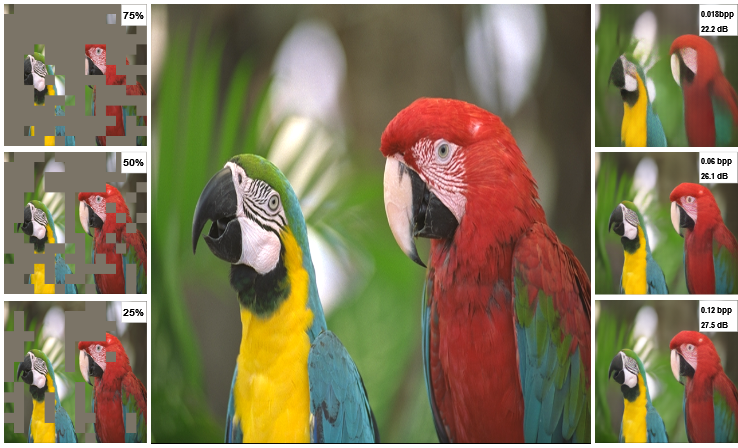
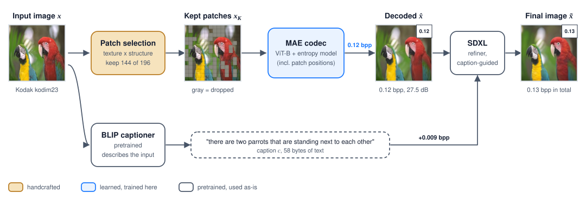
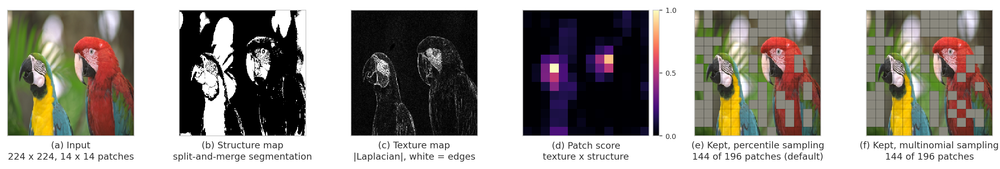
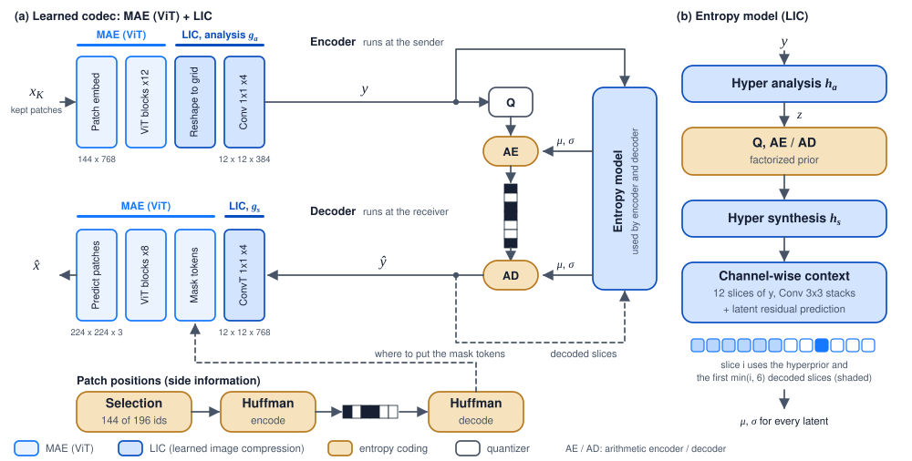
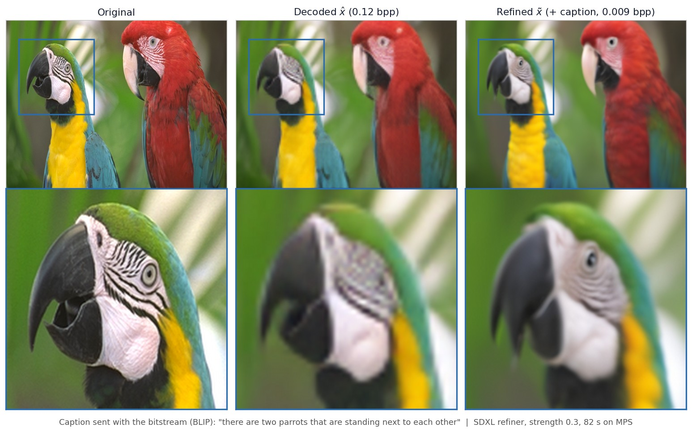
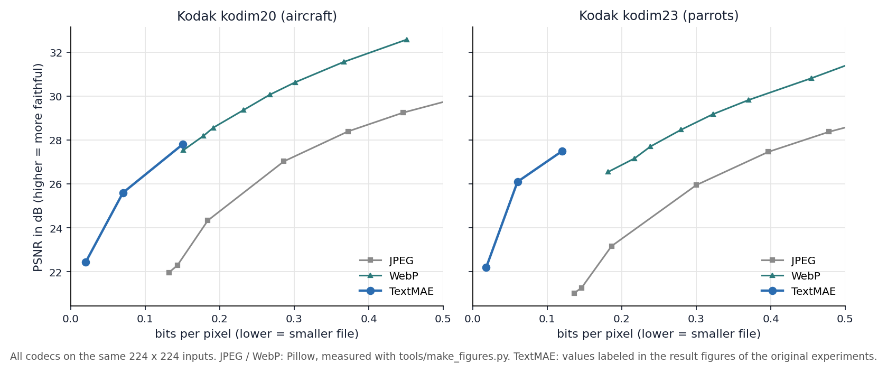
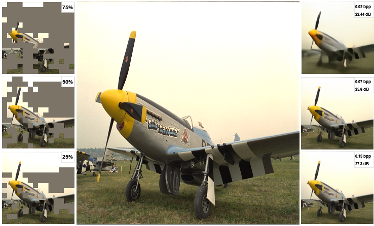

<div align="center">

# TextMAE: Text-Guided Masked Autoencoders for Low-Bitrate Image Compression

**Send the patches that matter and one sentence of text. A Masked Autoencoder and a diffusion model rebuild the rest.**

[Khang Tran](https://github.com/tmkhang1999) &nbsp;|&nbsp; personal research project, 2023




<sub>Left: what the encoder sees when 75, 50 or 25 % of the patches are dropped (gray). Middle: original. Right: decoded images at three bit rates.</sub>

</div>

## Overview

Most image codecs spend the same effort on every region, including smooth sky and blurred background that a neural network can fill in by itself. The purpose of this project is to test whether a codec can send only the informative patches and still reconstruct a good image at very low bit rates. TextMAE does this in three steps: it drops the easy patches, codes the remaining ones with a learned codec, and adds a one-sentence caption so that a diffusion model can restore detail.

On two Kodak images, TextMAE reaches **22 dB at 0.02 bpp**, a rate at which JPEG and WebP cannot produce an image at all. At 0.12 bpp it is 6.5 dB better than JPEG at a similar size ([Results](#results)).

<p align="center">
  
</p>

Two terms are used throughout. **bpp** (bits per pixel) is the file size divided by the number of pixels, so lower means a smaller file. **PSNR** (in dB) measures how close the decoded image is to the original, so higher means a more faithful image.

## Method

The figure above shows the three stages. Blue boxes are trained here, orange boxes are handcrafted, and white boxes are pretrained models used as-is. The bit rate on each arrow is the cost of that stage.

**First, patch selection.** Every 16x16 patch receives a score: the product of a *structure* score (quad-tree segmentation) and a *texture* score (absolute Laplacian), normalised to [0, 1]. Smooth patches score low because the decoder can infer them from their neighbours. The default *percentile sampling* keeps 144 of 196 patches: it always keeps the top score bucket and shares the rest of the budget across the other buckets by the softmax of their mean score. A *multinomial* variant samples patches in proportion to their score.

<p align="center">
  
</p>
<p align="center"><sub>Scoring and selection on Kodak <code>kodim23</code>. Gray patches are dropped before encoding; the eyes, beaks and feather edges are kept.</sub></p>

**Second, the learned codec.** A ViT encoder (MAE, ViT-B) processes only the kept patches, and $g_a$ maps their 12 x 12 token grid to the latent $y$. A hyperprior and a channel-wise context model predict a Gaussian for each of 12 slices of $y$, and these predictions drive an rANS arithmetic coder. Because the decoder must know where the kept patches belong, their positions are sent as Huffman-coded side information. The decoder inserts a learned mask token at each of the 52 dropped positions and predicts all 196 patches. The codec is trained end to end with a rate-distortion loss, where $\mathcal{L}_{\text{VGG}}$ compares VGG-16 features and $\lambda$ balances size against quality:

$$
\mathcal{L} = \underbrace{\mathbb{E}\left[-\log_2 p(\hat y \mid \hat z) - \log_2 p(\hat z)\right] / N_{\text{pixels}}}_{\text{rate (bpp)}} + \lambda \left(0.25\,(1-\mathrm{SSIM}) + 10\,\lVert x-\hat x\rVert_1 + 0.1\,\mathcal{L}_{\text{VGG}}\right)
$$

<p align="center">
  
</p>
<p align="center"><sub>Detail of the learned codec. (a) The ViT encoder and <i>g<sub>a</sub></i> map the kept patches to the latent <i>y</i>, which is quantized (Q) and arithmetic-coded (AE / AD); <i>g<sub>s</sub></i> and the ViT decoder reconstruct the image, inserting mask tokens at the dropped positions. (b) The entropy model predicts a Gaussian (&mu;, &sigma;) for every latent.</sub></p>

**Third, text guidance.** BLIP describes the original image in one sentence, and the caption is sent with the bitstream as plain text. At the decoder, the Stable Diffusion XL refiner runs image-to-image on $\hat x$ with the caption as its prompt, so the detail it adds matches what the image shows. The reported rate is the bits of $y$, $z$, the patch positions and the caption, divided by the number of pixels.

<p align="center">
  
</p>
<p align="center"><sub>A real run of this stage on an Apple M3 Pro (<code>tools/refine_example.py</code>). The caption <i>"there are two parrots that are standing next to each other"</i> costs 58 bytes (+0.009 bpp). The refiner restores feather texture and a sharp eye, but it redraws the facial stripes differently from the original.</sub></p>

## Results

<p align="center">
  
</p>

Each point is one compressed file, and up and to the left is better. JPEG and WebP were measured with Pillow on the same 224 x 224 inputs, using the PSNR of `evaluate.py`. The TextMAE points come from the trained model of the original experiments and are measured before refinement.

| Image | Low rate | Medium rate | High rate |
|:------|:------:|:------:|:------:|
| Aircraft (kodim20) | 0.020 bpp / 22.44 dB | 0.07 bpp / 25.6 dB | 0.15 bpp / 27.8 dB |
| Parrots (kodim23)  | 0.018 bpp / 22.2 dB  | 0.06 bpp / 26.1 dB | 0.12 bpp / 27.5 dB |

1. **Below 0.13 bpp, only TextMAE works.** JPEG stops at about 0.13 bpp and WebP at about 0.15 to 0.18 bpp, while TextMAE still gives 22 dB at 0.02 bpp.
2. **At similar sizes, TextMAE is clearly better than JPEG.** On the parrots, it gives 27.5 dB at 0.12 bpp, against 21.0 dB for JPEG at 0.14 bpp.
3. **Against WebP, TextMAE is on par or better.** On the aircraft, the two are within 0.3 dB at 0.15 bpp (27.8 against 27.5 dB). On the parrots, TextMAE reaches 27.5 dB at 0.12 bpp, while WebP's lowest setting gives 26.6 dB at 0.18 bpp.

<p align="center">
  
</p>

## Discussion

These results are encouraging, but they should be read with care.

- **The evaluation is small.** It covers two Kodak images at three rates, and no run without patch dropping was done, so the contribution of each idea is not measured.
- **Generated detail is plausible, not faithful.** The refiner invents texture that fits the caption (see the facial stripes above). It can look better while scoring lower in PSNR, so a perceptual metric such as LPIPS or FID would judge it more fairly.
- **Side information is costly at very low rates.** The 58-byte caption adds 0.009 bpp, which is a third of the budget at 0.02 bpp, and the patch positions add more.
- **The decoder is heavy.** BLIP and SDXL need about 8 GB of weights, and refining one 1024 x 1024 image takes 82 s on an M3 Pro. This suits archival storage more than real-time use.
- **The code changed after the experiments.** Three bugs were fixed: the decoder is now placed correctly (each kept token was one position off), the texture map uses the original image, and ties between equal scores are broken at random. The old checkpoints are therefore not compatible and would need retraining.

In sum, dropping patches by score and guiding the decoder with a short caption is a promising way to reach rates below those of JPEG and WebP. A full Kodak evaluation and an ablation are the natural next steps.

## Related work

TextMAE builds on the hyperprior and channel-wise entropy models of Ball&eacute; et al. (2018) and Minnen & Singh (2020), and on the Masked Autoencoder of He et al. (2022). Text-guided compression at ultra-low bit rates appeared in parallel: Text + Sketch (Lei et al., 2023) and PerCo (Careil et al., ICLR 2024) send a caption and regenerate the image with a diffusion model. TextMAE differs in that it keeps a conventional codec for the important patches and uses the caption only to refine the result, so the output stays anchored to the transmitted pixels.

## Getting started

```bash
git clone https://github.com/tmkhang1999/TextMAE-Image-Compression.git
cd TextMAE-Image-Compression
pip install -r requirements.txt   # timm must be 0.4.5

# 1. patch scores (the same --input_size for training and evaluation)
python generate_scores.py --training_path datasets/train_dataset --testing_path datasets/test_dataset
# 2. train the codec
python train.py -d datasets/train_dataset --epochs 100 --output_dir weights --log_dir logs
# 3. compress and decompress the test set (reconstructions and report.json)
python evaluate.py -d datasets/test_dataset -c weights/best_model.pth -o results --cuda
# 4. text guidance: BLIP captions and SDXL refinement (CUDA, Apple MPS or CPU)
python refine.py -d datasets/test_dataset -r results -o results_refined
```

Training uses `datasets/<name>/{train,val}/*.png`, and testing uses `datasets/<name>/*.png`; the score files are written to `datasets/<name>_scores/`. The Kodak images are included. Useful options are `--model` (`textmae_base_patch16` or `textmae_large_patch16`), `--num_keep_patches`, `--patch_selection` (`stratified` or `multinomial`), `--pretrained` (an official MAE checkpoint) and `--lambda`. `setup.sh` downloads the MAE ViT-Large weights, and `python tools/make_figures.py` rebuilds the figures.

```
train.py  evaluate.py  refine.py  generate_scores.py    entry points
textmae/   config, data, models, losses, coding, engine, utils
extras/    BLIP / BLIP-2 captioner and SDXL refiner
tools/     figure generation, refinement example, dataset preparation
```

## Acknowledgements and citation

This project builds on [MAE](https://github.com/facebookresearch/mae), [CompressAI](https://github.com/InterDigitalInc/CompressAI), [BLIP](https://github.com/salesforce/BLIP) and the [Stable Diffusion XL refiner](https://github.com/Stability-AI/generative-models).

```bibtex
@misc{tran2023textmae,
  author       = {Khang Tran},
  title        = {TextMAE: Text-Guided Masked Autoencoders for Low-Bitrate Image Compression},
  year         = {2023},
  howpublished = {\url{https://github.com/tmkhang1999/TextMAE-Image-Compression}}
}
```
